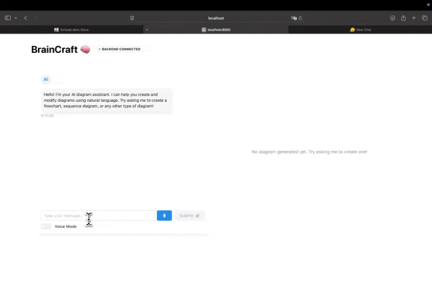

# BrainCraft

A powerful AI-powered diagramming tool that helps you create and refine diagrams using natural language.


## Features

- Generate diagrams from natural language descriptions
- Support for multiple diagram types (flowcharts, sequence diagrams, class diagrams, etc.)
- Real-time diagram rendering
- Interactive diagram refinement
- Modern and intuitive user interface
- Theme customization support

## Prerequisites

- Node.js (v16 or higher)
- Python (3.8 or higher)
- npm or yarn package manager
- Docker and Docker Compose (for containerized setup)

## Setup and Running

You can run BrainCraft either using Docker (recommended) or locally.

### Option 1: Docker Setup (Recommended)

1. First, create the necessary environment files:
```bash
# Create and configure backend environment
cp backend/.env.example backend/.env
# Edit backend/.env and add your API keys:
# - MISTRAL_API_KEY (required)
# - OPENAI_API_KEY (optional)
# - LMNT_API_KEY (optional)

# Create and configure frontend environment
cp frontend/.env.local.example frontend/.env.local
```

2. Run Docker Compose from the project root directory:
```bash
# Build and start the containers
docker compose -f docker/docker-compose.yml up --build
```

The application will be available at:
- Frontend: http://localhost:3000
- Backend API: http://localhost:8000

To stop the services:
```bash
# Press Ctrl+C in the terminal or run:
docker compose -f docker/docker-compose.yml down
```

### Option 2: Local Setup

You'll need to run both the frontend and backend services in separate terminals.

#### Terminal 1: Frontend Setup

```bash
# Navigate to frontend directory
cd frontend

# Install dependencies
npm install

# Set up environment variables
cp .env.local.example .env.local

# Start development server
npm run dev
```

The frontend will be available at `http://localhost:3000`

#### Terminal 2: Backend Setup

```bash
# Navigate to backend directory
cd backend

# Set up the environment
uv sync

# Set up environment variables
cp .env.example .env
# Edit the .env file and add your API keys:
# - MISTRAL_API_KEY: Your Mistral API key

# Start the backend server
uv run uvicorn src.main:app --reload --port 8000
```

The backend API will be available at `http://localhost:8000`

## Usage

1. Open your browser and navigate to `http://localhost:3000`
2. Enter a description of the diagram you want to create
3. Click "Generate" to create your diagram
4. Use the refinement options to modify the diagram as needed

## Development

- Frontend: Built with Next.js, TypeScript, and Mantine UI
- Backend: FastAPI with Mistral AI, OpenAI, and LMNT integration
- Diagram Rendering: Mermaid.js

## Contributing

1. Fork the repository
2. Create your feature branch (`git checkout -b feature/amazing-feature`)
3. Commit your changes (`git commit -m 'Add some amazing feature'`)
4. Push to the branch (`git push origin feature/amazing-feature`)
5. Open a Pull Request

## License

This project is licensed under the MIT License - see the LICENSE file for details.
